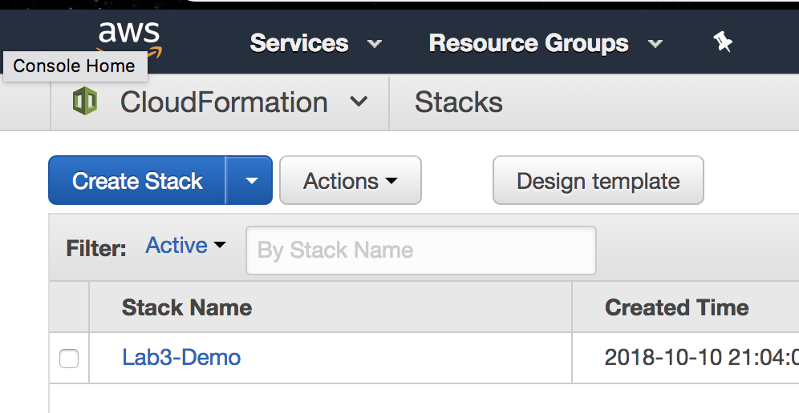
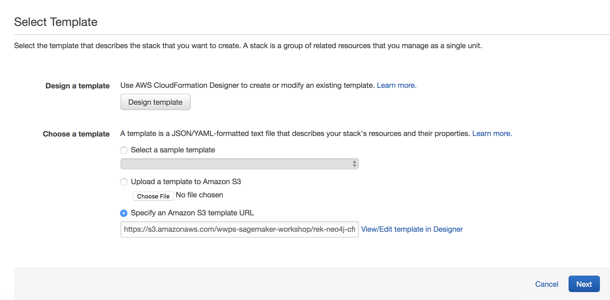
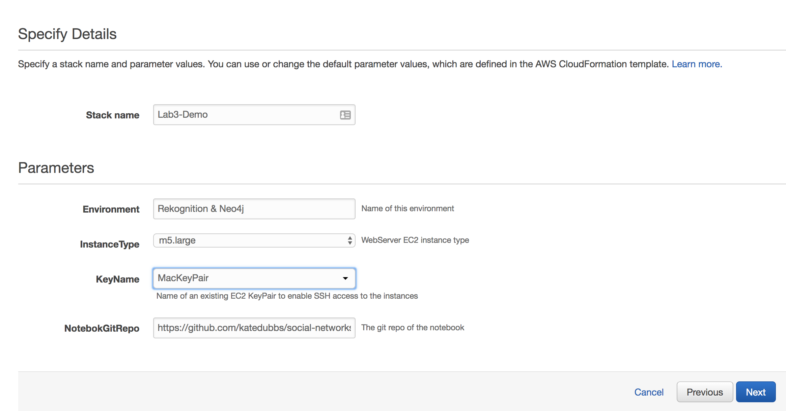
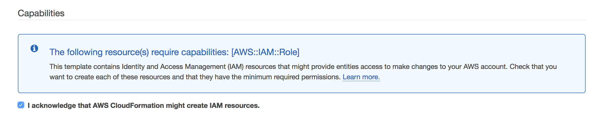
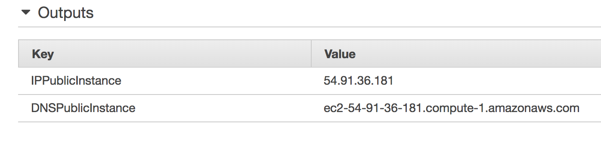
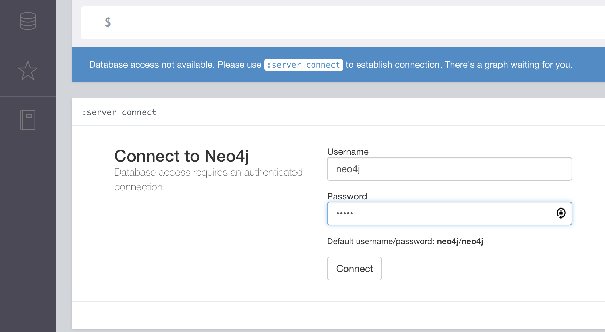
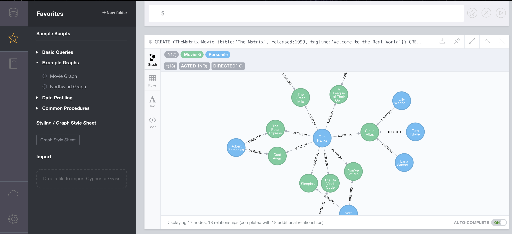
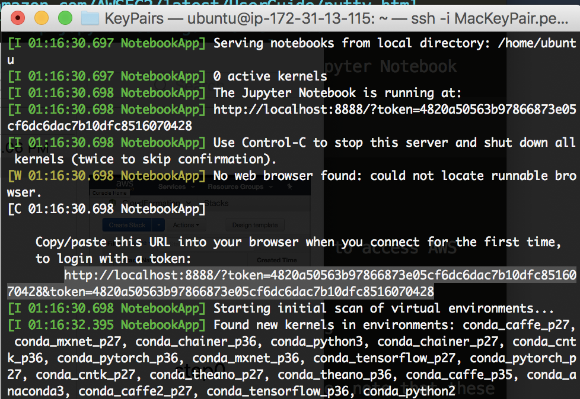
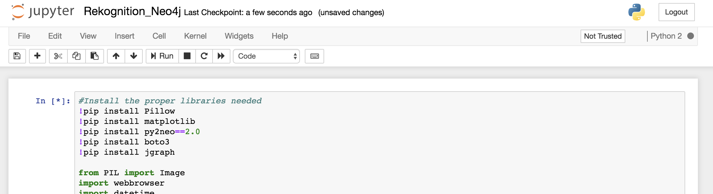

# Overview

This lab guides you to build a serverless solution in AWS that uses Machine Learning to analyze the sentiment and the entities appearing in a stream of tweets.


This lab highlights the use of AWS Rekognition's facial identification functionality. It will identify celebrity faces (http://docs.aws.amazon.com/rekognition/latest/dg/celebrity-recognition.html) and use the Movie Graph Database (https://neo4j.com/developer/movie-database/#_download) hosted in a Neo4j database instance to render a graphical representation of the relationship between two celebrities (ala Six Degrees of Kevin Bacon, https://en.wikipedia.org/wiki/Six_Degrees_of_Kevin_Bacon).

# Prerequisites

- A Key-Pair for your EC2 instance (https://docs.aws.amazon.com/AWSEC2/latest/UserGuide/ec2-key-pairs.html#having-ec2-create-your-key-pair)
- PuTTy (https://www.putty.org/)


# Launch the CloudFormation Template

## Download the Cloudformation File
1. Right click the following link and click "Save Target As" https://github.com/kate-dubbs/social-networks-rekognition-neo4j/blob/master/rek-neo4j-cfn.template
2. Navigate to Amazon CloudFormation in the AWS Console
3. Click Create Stack

4. Select Upload a template to Amazon S3, then click Choose File and navigate to the template you saved in Step 1. Click Next.

5. Type in any value you want for Stack Name
6. Under Parameters, leave everything default except the KeyName. Select the Key you created as part of the prerequisites. If you did not create a key-pair, you can find instructions for creating a Key-Pair here: https://docs.aws.amazon.com/AWSEC2/latest/UserGuide/ec2-key-pairs.html#having-ec2-create-your-key-pair

7. Once these fields are completed click Next. Accept the defaults on the next screen and click Next again.
8. On the final screen, select the radio button, that acknowledges that Amazon Cloudformation will create IAM resources on your behalf. Then click Create.


# Setup Neo4j

1. When your Amazon Cloudformation template is finished deploying you will see a CREATE_COMPLETE status in the Amazon CloudFormation service page. When your template is finished deploying, click on the Stack Name of the template.

2. Click on Outputs to view the Public IP address of the EC2 instance you created, you will need this in the following steps.

3. To access Neo4j, paste http://[DNSPublicInstance]:7474 into your browser. So the url will look something like: http://ec2-54-91-36-181.compute-1.amazonaws.com:7474
4. In Neo4j, you will need to configure a password. I recommend just using the word password for this lab, because that is the default password in the Jupyter Notebook. If you set your password to something else, make sure you remember it and update it in the Jupyter Notebook later in this lab. The default password is neo4j. So sign in with neo4j as both the username and password.

5. You can play around with the movie database in Neo4j by clicking on the star symbol in the menu on the left. Then click "Example Graphs" and select the Movie Graph radio button. This will open a window on the right that describes the Movie Graph data, click the right arrow to scroll to the query example. Clicking the query code will automatically run the example query and build an example graph.


# Log in to the Deep Learning AMI

1. To SSH into your EC2 instance with the Deep Learning AMI use the following guides based on your operating system. You will need your key-pair from earlier and your DNS address from the Output of your CloudFormation stack.
    - Windows Client: https://docs.aws.amazon.com/dlami/latest/devguide/setup-jupyter-configure-client-windows.html
!! IMPORTANT: PuTTy does not work with a .pem file, you will need to use a .ppk file. Instructions for converting your pem file to a ppk file can be found here: https://docs.aws.amazon.com/AWSEC2/latest/UserGuide/putty.html
    - Mac Client: https://docs.aws.amazon.com/dlami/latest/devguide/setup-jupyter-configure-client-mac.html
    - https://docs.aws.amazon.com/dlami/latest/devguide/setup-jupyter-configure-client-linux.html
2. Once you are SSH'd into your instance (and have port forwarding configured) we will start the Jupyter Notebook server by simply typing:
```
jupyter notebook
```

3. The notebook server may take some time the first time you start it. Once it is running, you will see a url that you can copy and paste into your browser to view the notebook instance. 

4. In the Jupyter Notebook, click on the Notebooks folder and open the Rekognition_Neo4j.ipynb notebook
5. You will follow the instructions in this notebook for the rest of the lab.


# Clean Up

The final step of this lab is to delete the resources you created. 
1. Return to the Amazon Cloudformation service page.
2. Select the box next to your Stack Name.
3. Click Actions and then Delete Stack, this will remove all the resources created by the CloudFormation template.